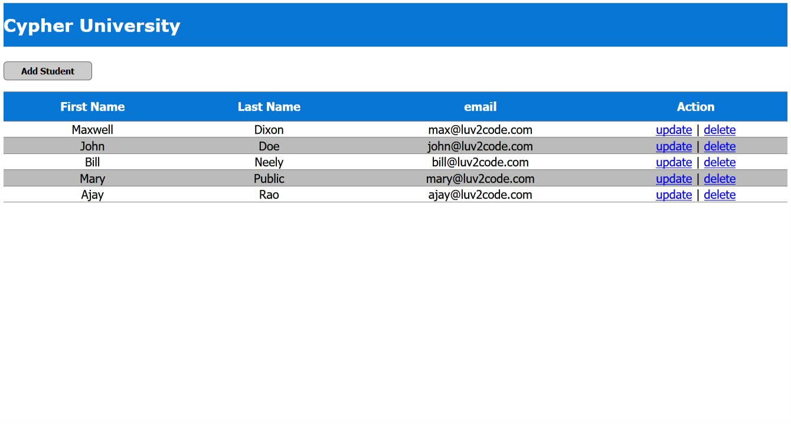
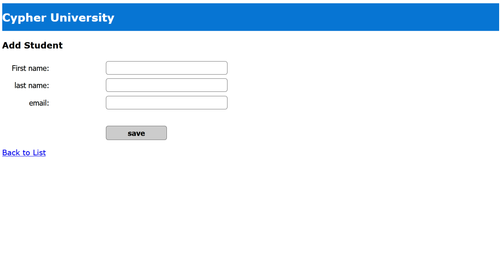
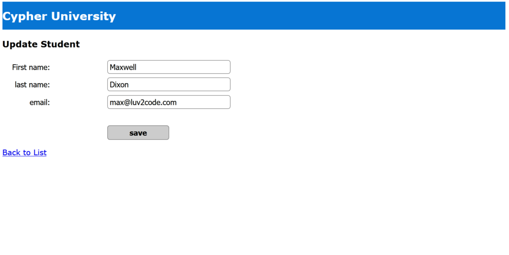

# Student Tracker Application

## Description
This web application allows two players to play a game of Pig Dice.

This is a simple Java Web Application which displays the students information from a MySQL database and perform the CRUD operations.

### Features
* _list all the students from the University database_
* _add a new student to the University database_
* _update student information already present in University database_
* _delete a student from the University database_

## Notes
#### _Technologies Used:_
* _Java EE_
* _MySQL_
* _JSP_
* _CSS3_
* _JavaScript_

#### _Tools Used:_
* _Eclipse IDE_
* _MySQL Workbench 8.0_
* _Apache Tomcat® 9.0.12_

  
  
  

